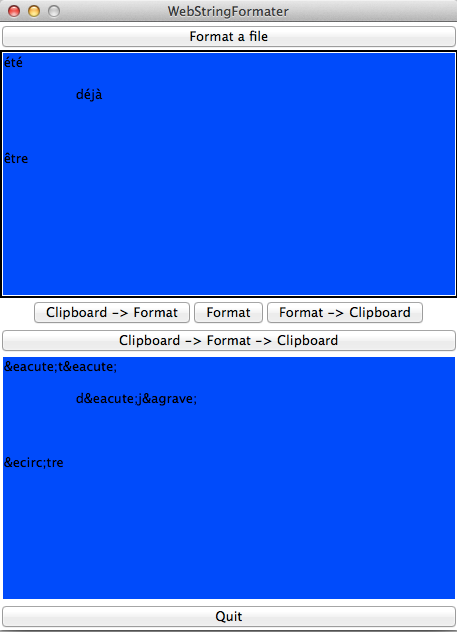

# html-entity-formatter
A GUI to conver string to html entity string

html-entity-formatter allows you to convert non-html characters from the clipboard, a file or by writing them inside the input zone. Conversion will be displayed into the output zone. 

You can also convert text inside your clipboard without flushing it.

##Screenshots

## License

Released under Apache License 2.0
